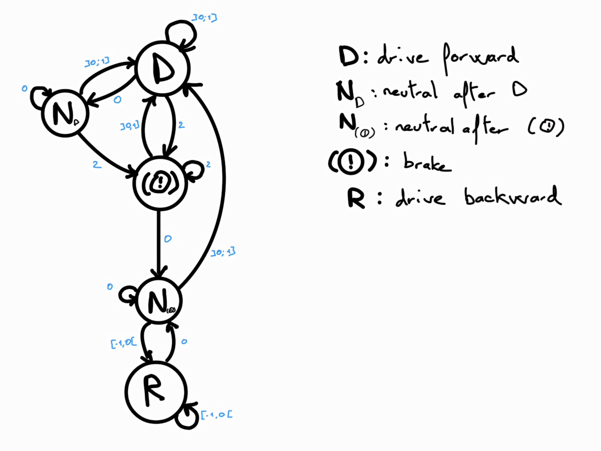

# control_bolide ROS Package

This repository contains the control ROS package for the COVAPSY Autonomous RC Car Race project, developed by the Sorbonne University team.

## Project Overview

- **Main Git Repository for the 2024 Race:** [Course_2024](https://github.com/SorbonneUniversityBolideContributors/Course_2024)

### Project Packages

This control package is one of the three main packages in the project:

1. **Perception:** [perception_bolide](https://github.com/SorbonneUniversityBolideContributors/course_2024_pkgs/tree/main/perception_bolide)
2. **Planning:** [planning_bolide](https://github.com/SorbonneUniversityBolideContributors/course_2024_pkgs/tree/main/planning_bolide)
3. **Control (current):** [control_bolide](https://github.com/SorbonneUniversityBolideContributors/course_2024_pkgs/tree/main/control_bolide)

## Package content

This package contains the control node for the bolide robot. It is responsible for controlling the robot's speed, direction and brakes.

#### `src/` contains the source code for the control node:

- `speed_direction_controller.py`: The main node that controls the robot's speed, direction and brakes (see the section below for more details).

#### `src_vizu/` contains the source code for the visualization nodes:
- `cmd_vel_vizu.py`: Used to visualize the robot's speed and direction command on the `cmd_vel` topic.

#### `msg/` contains the custom message definition:
- `SpeedDirection.msg`: The message used to send the speed and direction to the robot.

## Calibration of the direction

If the robot isn't braking enough when the direction is set to 1 or -1, you can recalibrate the direction using the `calibrate_direction.py` script and by following the instructions of the `PFE_2024/Ressources/Tuto_Covapsy/CoVAPSy_Premiers programmes python sur la voiture réelle_V2.pdf` file on the google drive.

This script will give you PWM values to put in the `speed_direction_controller.py` script in the attributes below:
```py
# Values for the direction
self.CENTER = 7
self.LEFT = 5.5
self.RIGHT = 8.4
```

## Breaking down the speed_direction_controller node

The node use a state machine to control the robot. The state machine is composed of 5 states as shown in the schema below:



### Choice of the state machine

Firstly, to go backward, the robot needs to brake, then go neutral and finally go backward.
This explain why there are to neutral states, one after going forward and one after brakeing.

Furthermore, if the robot is going backward and a "brake" command is send on the pwm channel, the robot will go backward but faster.
So when going backward the robot can't brake before going forward.

The way the robot is controlled is by sending a pwm signal on the pwm channel.
For more explanation on how the pwm signal is used to control the robot, see the `PFE_2024/Ressources/Tuto_Covapsy/CoVAPSy_Premiers programmes python sur la voiture réelle_V2.pdf` file on the google drive.

### How to use the node

#### The cmd_vel topic:

The node subscribes to the `cmd_vel` topic. This topic is of type `control_bolide.msg.SpeedDirection` and is used to send the speed and direction to the robot.

The message is composed of two fields:
- `speed`: a value include in [-1, 1]U{2} where:
    - 0 is the neutral speed
    - speed>0 is a percentage of the maximum speed forward
    - speed<0 is a percentage of the maximum speed backward
    - 2 is used for the brake
- `direction`: a value include in [-1, 1] where:
    - 0 is the neutral direction
    - direction>0 is a percentage of the maximum direction right
    - direction<0 is a percentage of the maximum direction left

#### The emergency_brake topic:

The node subscribes to the `emergency_brake` topic. This topic is of type `std_msgs/Bool` and is used to send an emergency brake command to the robot.

This topic overrides the `cmd_vel` message and works as a switch: if the message is `True`, the robot will brake until it receives a `False` message.

Due to the way the pwm signals are working if the `emergency_brake` message is `True`, the robot will brake only if it wasn't in the `Backward` or `Neutral_After_Braking` (it will go neutral if it was in one of this states).
